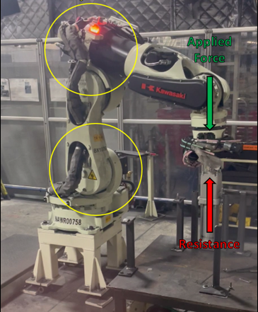
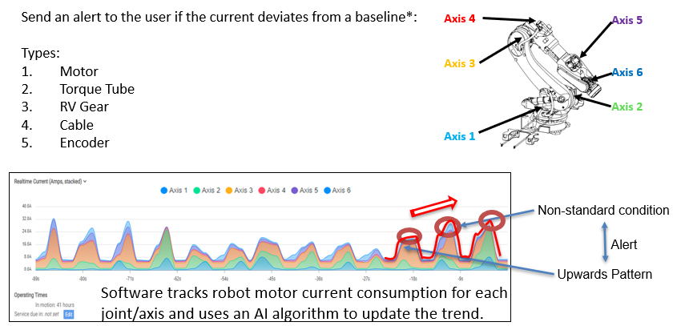

# Foundations of Machine Learning Frameworks

Workshop on Data Streaming and Visualization Workshop
Use case: Robot Predictive Maintenance

In this hands-on session, you and your team will build an **Predictive Maintenance Dashboard** application, the visibility tool of an Anomaly Detection and response management workflow in a manufacturing facility.

Purpose: Robot Predicative Maintenance tool that collects electrical load data for each joint and other relevant data, then applies Machine Learning to set standard operating patterns and identify anomalies.

The target is to **predict equipment failure** by using a condition monitoring system based on the collection of a robot’s power measurements and the detection of errors and inaccuracies based on electricity and torque data analysis.

# 📊 Robot Monitoring System — Use Case & Problem Definition

## 🧠 Use Case Description

In industrial automation environments, robots play a vital role in manufacturing processes. These robots are equipped with multiple axes (motors), and their energy consumption provides crucial insights into their operational state. Monitoring real-time current data across these axes allows engineers to detect anomalies, predict maintenance needs, and ensure smooth production workflows.

This application simulates **real-time streaming of robot current sensor data**, stores it in a **PostgreSQL (Neon) database**, and provides a live visualization of the energy consumption trends for proactive monitoring.

The solution mimics data collection from robot controllers and enables ongoing tracking using stacked area plots that update every 2 seconds.

---

## ❗️Problem Definition

Without proper real-time visibility into robot performance metrics (such as current consumption per axis), factories risk:

- **Unexpected downtime** due to undetected anomalies
- **Inefficient maintenance schedules** leading to over- or under-servicing
- **Difficulty identifying energy-intensive operations** for optimization

The specific challenge addressed here is:

> _"How can we simulate and visualize real-time robot performance data in a way that allows engineers to store, analyze, and act on it promptly?"_

This notebook solves the problem by:

- Streaming readings from a CSV file at fixed intervals (every 2 seconds)
- Storing the data in a **Neon-hosted PostgreSQL database**
- Plotting the most recent 90 readings in a live-updating chart
- Enabling downstream analysis and alerting for **anomalies** or **maintenance triggers**

# CSCN8010_Introduction
Foundations of Machine Learning Frameworks - Week 2 - Data Streaming and Visualization Workshop
Robot Predictive Maintenance

